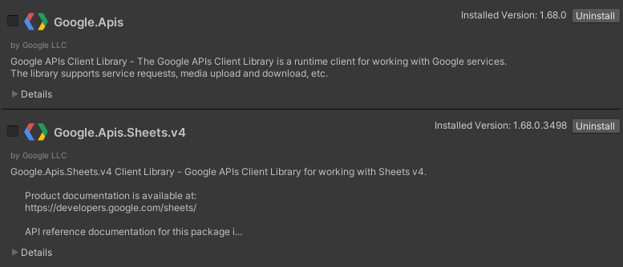
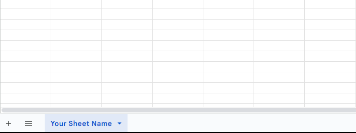
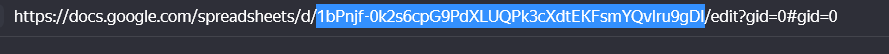
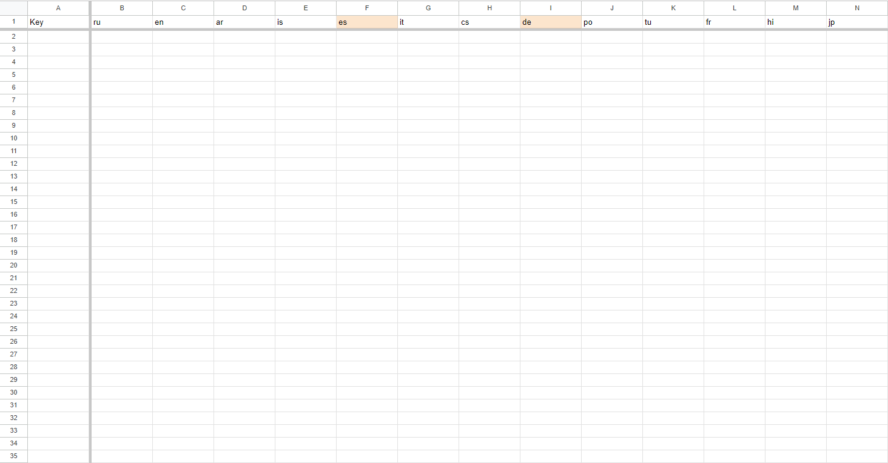

# GoogleSheetsLocalization

## Installation
### 1. Install NuGetForUnity via UPM:
    https://github.com/GlitchEnzo/NuGetForUnity.git?path=/src/NuGetForUnity
  - For older versions see [NuGetForUnity](https://github.com/GlitchEnzo/NuGetForUnity) Repo
### 2. Install Google API packages via NuGet:
  - Open `NuGet` > `Manage NuGet Package`
  - Install `Google.Apis.Sheets.v4`
  <br><br>
  
### 3. Install GoogleSheetsLocalization via UPM:
    https://github.com/Maksibi/GoogleSheetsLocalization.git
## Setup
### 1. Create LocalizationHolder ScriptableObject
  - `Assets` > `Create` > `LocalizationHolder`
### 2. Fill out your information in LocalizationHolder
  - `Api Key` - your google sheets api key, you can find it [here](https://console.cloud.google.com/)
  - `Sheet Name` - name of sheet in GoogleSheets, can be found at bottom of GoogleSheets
  <br><br>
  
  - `Sheets ID` - id of sheets in GoogleSheets, can be fount in URL of GoogleSheets
  <br><br>
  
### 3. Setup your table
  - Your table should look like this:
  <br><br>
  
  - Fill your Keys and LocalizationValues according to layout of the table
### 4. Download localization
  - Open context menu of LocalizationHolder and press DownloadLocalization

## Usage
- One way of using this package is a built in LocalizationSingleton and LocalizedText. Place LocalizationSingleton in first scene of project, call Init with lang code and place LocalizedText on every text you want to localize    
    ```
        LocalizationSingleton.Instance.CurrentLocalization["YourLocalizationKey"];
    ```
- Another way of using is accessing LocalizationHolder's Dictionary with all localizations, this way you can swap languages or localization tables with ease.
